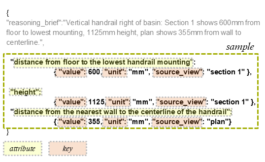

# 1.2 Scene Understanding: Inputs / Outputs by Notebook

This document describes, for each notebook in `eval/1_2_scene_understanding`:

1. required inputs;
2. where inputs come from;
3. generated outputs (`csv` / `xlsx`);
4. files needed to run the full 1.2 evaluation flow.

## Notebooks in This Section

1. `1_2_Eval_Claude_Opus.ipynb`
2. `1_2_Eval_Gemini.ipynb`
3. `1_2_Eval_GPT_5_2.ipynb`
4. `1_2_Eval_yes_no_Analysis.ipynb`
5. `1_2_Eval_MVSS_Analysis.ipynb`

---

## Overall Run Order

1. Run the three inference notebooks first (Claude, Gemini, GPT-5.2).
2. Each inference notebook writes model outputs (`with_answers`) and preview files.
3. Run `1_2_Eval_yes_no_Analysis.ipynb` for yes/no-style metrics summary.
4. Run `1_2_Eval_MVSS_Analysis.ipynb` for MVSS-style metrics summary.

---

## Shared Prerequisites for Inference Notebooks

- Working directory: `eval/1_2_scene_understanding`.
- Dataset currently used in notebooks:
  - `dataset/1_2_scene_understanding.csv`
- OpenRouter key:
  - loaded via `python-dotenv` from:
    - `../.env`
    - `../eval.env`
    - `../../eval.env`
  - then read from env var `OPENROUTER_API_KEY`.

For analysis notebooks:

- `1_2_Eval_yes_no_Analysis.ipynb` loads `.env/eval.env` in one setup cell, but does not call OpenRouter.
- `1_2_Eval_MVSS_Analysis.ipynb` does not require API key for metric computation.

Minimum expected input columns:

- `generated_question_id`
- `question_text`
- `ground_truth_answer`
- `relation_type`
- `answer_type`
- `layer_id`

---

## Why Inference Notebooks Are Separate

`Claude`, `Gemini`, and `GPT-5.2` inference are split into separate notebooks because:

- model-specific request behavior differs;
- retries/resume can be done per model independently;
- each model keeps isolated outputs (`1_2_with_answers_*.csv` and raw `jsonl` logs).

Analysis notebooks are separate because they aggregate already-generated outputs and compute metrics.

---

## Notebook: `1_2_Eval_Claude_Opus.ipynb`

### Purpose

Runs 1.2 inference with Claude Opus and exports answer files.

### Inputs

- `dataset/1_2_scene_understanding.csv`
- `OPENROUTER_API_KEY` from `eval.env/.env` (loaded via `python-dotenv`).

### Outputs

- Main output:
  - `1_2_with_answers_claude-opus-4_6.csv`
- Raw log:
  - `1_2_with_answers_claude-opus-4_6_raw.jsonl`
- Preview sample:
  - `1_2_preview_claude-opus-4_6.csv`
  - `1_2_preview_claude-opus-4_6_raw.jsonl`

### Preview Logic

- `PREVIEW_N = 5` for `relation_type == "adjacency"`;
- `PREVIEW_JSON_N = 3` for `answer_type == "json"`;
- total preview target: up to 8 rows;
- already-processed IDs from output CSV are skipped when possible.

---

## Notebook: `1_2_Eval_Gemini.ipynb`

### Purpose

Runs 1.2 inference with Gemini and exports answer files.

### Inputs

- `dataset/1_2_scene_understanding.csv`
- `OPENROUTER_API_KEY` from `eval.env/.env` (loaded via `python-dotenv`).

### Outputs

- Main output:
  - `1_2_with_answers_gemini.csv`
- Raw log:
  - `1_2_with_answers_gemini_raw.jsonl`
- Preview sample:
  - `1_2_preview_gemini.csv`
  - `1_2_preview_gemini_raw.jsonl`

### Preview Logic

Same sampling pattern as Claude:

- up to 5 adjacency rows + up to 3 json rows;
- duplicates are skipped based on existing output IDs when possible.

---

## Notebook: `1_2_Eval_GPT_5_2.ipynb`

### Purpose

Runs 1.2 inference with GPT-5.2 and exports answer files.

### Inputs

- `dataset/1_2_scene_understanding.csv`
- `OPENROUTER_API_KEY` from `eval.env/.env` (loaded via `python-dotenv`).

### Outputs

- Main output:
  - `1_2_with_answers_gpt-5_2.csv`
- Raw log:
  - `1_2_with_answers_gpt-5_2_raw.jsonl`
- Preview sample:
  - `1_2_preview_gpt-5_2.csv`
  - `1_2_preview_gpt-5_2_raw.jsonl`
- Postprocessed/clean output (from cleanup cell):
  - `1_2_clean_gpt-5_2.csv`

### Preview Logic

Same sampling pattern:

- up to 5 adjacency rows + up to 3 json rows;
- duplicate rows are skipped when previous results exist.

---

## Notebook: `1_2_Eval_yes_no_Analysis.ipynb`

### Purpose

Computes metrics for yes/no scene-understanding tasks and exports summary tables.

### Inputs

- Model outputs (`with_answers`) from inference notebooks, by model blocks:
  - Claude block: `1_2_with_answers_claude-opus-4_6.csv`
  - Gemini block: `1_2_with_answers_gemini.csv`
  - GPT block: `1_2_with_answers_gpt-5_2.csv`

No OpenRouter key is required.

### Outputs

- `1_2_yesno_summary.csv`
- `1_2_yesno_summary.xlsx`

---

## Notebook: `1_2_Eval_MVSS_Analysis.ipynb`

### Purpose

Computes MVSS-oriented metrics for 1.2 and exports summary tables.

### Inputs

- Model outputs (`with_answers`) from inference notebooks, by model blocks:
  - Claude block: `1_2_with_answers_claude-opus-4_6.csv`
  - Gemini block: `1_2_with_answers_gemini.csv`
  - GPT block: `1_2_with_answers_gpt-5_2.csv`

No OpenRouter key is required.

### Outputs

- `1_2_mvss_summary.csv`
- `1_2_mvss_summary.xlsx`

### MVSS Scoring (Short)

MVSS compares `value`, `unit`, and `source_view` attribute-by-attribute between ground truth and model JSON.  
`strict attribute match` is the share of attributes that match exactly; `mean MVSS` is the average sample-level partial score; `MVSS strict accuracy` is the share of samples with fully strict match.

---

## Known Current-State Inconsistencies

1. `1_2_Eval_GPT_5_2.ipynb` contains a helper cell with:
   - `INPUT = "1_2_with_answers_gpt-5_2_test.csv"`
   This is not part of the main run flow; main inference/export uses `1_2_with_answers_gpt-5_2.csv`.
2. Some saved notebook output-history lines may still show old paths or filenames from earlier runs.

These do not prevent documenting the flow, but should be normalized for a clean reproducible setup.

---

## Minimal File Set for Full 1.2 Evaluation

1. Input dataset:
   - `dataset/1_2_scene_understanding.csv`
2. Inference notebooks:
   - `1_2_Eval_Claude_Opus.ipynb` -> `1_2_with_answers_claude-opus-4_6.csv`
   - `1_2_Eval_Gemini.ipynb` -> `1_2_with_answers_gemini.csv`
   - `1_2_Eval_GPT_5_2.ipynb` -> `1_2_with_answers_gpt-5_2.csv`
3. Analysis notebooks:
   - `1_2_Eval_yes_no_Analysis.ipynb` -> `1_2_yesno_summary.csv`, `1_2_yesno_summary.xlsx`
   - `1_2_Eval_MVSS_Analysis.ipynb` -> `1_2_mvss_summary.csv`, `1_2_mvss_summary.xlsx`

---

## Submission Readiness (External User)

- Current state is usable and close to submission.
- Before external handoff, it is recommended to either remove or clearly mark:
  - the `_test.csv` helper cell in `1_2_Eval_GPT_5_2.ipynb`.
