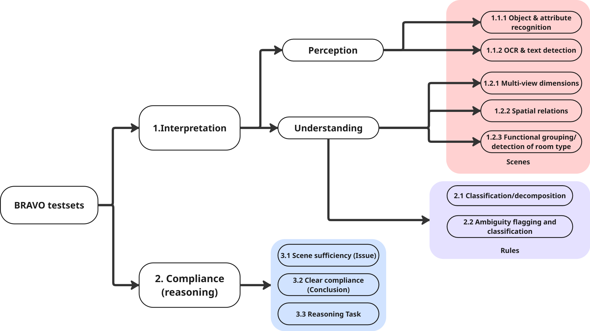

# Evaluation Setup (Quick Guide)

This is a compact overview of `eval/`: what each folder contains, what to run, and where to find detailed documentation.

## 1) Before You Run Anything

1. Environment and dependencies: [../scripts/SETUP.md](../scripts/SETUP.md)  
2. SBERT/transformers issues: [Sentence-BERT_Setup_troubleshooting.md](Sentence-BERT_Setup_troubleshooting.md)  
3. API keys:
   - keep OpenRouter key in `eval/.env` (or environment variables),
   - do not store keys in notebooks.

---

## 2) Folder Overview

### 2.1 `1_1_scene_perception`

- Contains model eval notebooks + analysis for Scene Perception.
- Detailed IO guide: [1_1_inputs_outputs.md](1_1_scene_perception/1_1_inputs_outputs.md)

### 2.2 `1_2_scene_understanding`

- Contains model eval notebooks + two analysis tracks (`yes/no` and `MVSS`).
- Detailed IO guide: [1_2_inputs_outputs.md](1_2_scene_understanding/1_2_inputs_outputs.md)

### 2.3 `2_rule_understanding`

#### `2_1-2_rule_classific_decompos`
- Rule classification/decomposition evaluation notebooks and analysis.
- Inputs/outputs: [2_1-2_inputs_outputs.md](2_rule_understanding/2_1-2_rule_classific_decompos/2_1-2_inputs_outputs.md)
- Methodology and field definitions: [2_1-2_Rule_Classification_Eval.md](2_rule_understanding/2_1-2_rule_classific_decompos/2_1-2_Rule_Classification_Eval.md)

#### `2_3_ambiguity`
- Ambiguity-focused model evaluation notebooks.
- Inputs/outputs: [2_3_inputs_outputs.md](2_rule_understanding/2_3_ambiguity/2_3_inputs_outputs.md)

### 2.4 `3_compliance_reasoning`

#### `3_1_scene_sufficiency`
- Template-39 scene sufficiency evaluation.
- Inputs/outputs: [3_1_inputs_outputs.md](3_compliance_reasoning/3_1_scene_sufficiency/3_1_inputs_outputs.md)

#### `3_2_bool`
- Boolean compliance reasoning eval + analysis.
- Inputs/outputs: [3_2_inputs_outputs.md](3_compliance_reasoning/3_2_bool/3_2_inputs_outputs.md)
- Rule-only baseline docs: [3_2_rule_only_inputs_outputs.md](3_compliance_reasoning/3_2_bool/rule_only_baseline/3_2_rule_only_inputs_outputs.md)

#### `3_3_reasoning_analysis`
- Stepwise reasoning analysis in two modes:
  - human-centered,
  - LLM-as-a-judge automatic adjudication.
- Compact IO map: [3_3_inputs_outputs.md](3_compliance_reasoning/3_3_reasoning_analysis/3_3_inputs_outputs.md)
- Human-centered methodology: [3_3_Stepwise_Eval.md](3_compliance_reasoning/3_3_reasoning_analysis/3_3_Stepwise_Eval.md)
- LLM-as-a-judge methodology: [3_3_Stepwise_LLM-as-a-judge.md](3_compliance_reasoning/3_3_reasoning_analysis/3_3_Stepwise_LLM-as-a-judge.md)
- Archived v1 judge approach: [LLM-as-a-judge_V1.md](3_compliance_reasoning/3_3_reasoning_analysis/3_3_archive_LLM_judge/LLM-as-a-judge_V1.md)

---

## 3) Practical Execution Pattern

For most sections:

1. Run model notebooks (`*_Eval_*.ipynb`) to produce model output tables.  
2. Run analysis notebook/script for aggregation and final metrics.  
3. Check the section-specific `*_inputs_outputs.md` to confirm exact input/output filenames.

For `3_3_reasoning_analysis`, choose one primary path:
- human-centered stepwise flow, or
- LLM-as-a-judge stepwise flow.

---

## 4) Minimum Data Expectations

Most evaluation notebooks expect standardized columns such as:
- `ground_truth_answer`
- `model_answer`
- `template_id`

Reasoning notebooks also require routing/context columns for GT linkage (for example `scene_id`, `ParentRuleID`, `rule_figure_id`).

---

## 5) Read This First (Recommended)

1. This file: [eval_SETUP.md](eval_SETUP.md)  
2. Section inputs/outputs file (for the folder you run)  
3. Section methodology file (if available)  
4. Troubleshooting only if needed: [Sentence-BERT_Setup_troubleshooting.md](Sentence-BERT_Setup_troubleshooting.md)
